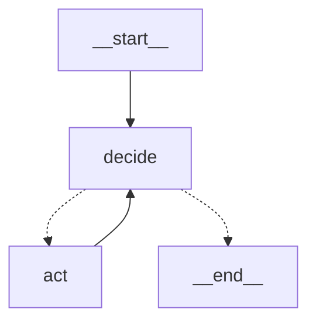

# VC·OS — AI Engineer Portfolio

A retro Mac OS 1984 desktop (frontend) backed by a real AI service (FastAPI + Gemini, or any OpenAI-compatible API such as Groq or Ollama) that answers
questions about me, grounded in a profile and a set of **skills**.

> `main` = static GitHub Pages site. `ai-fullstack` = this full-stack version.

## Run
```bash
cp .env.example .env            # add GEMINI_API_KEY (or LLM_PROVIDER=openai + LLM_BASE_URL/LLM_API_KEY for Groq/Ollama; LLM_PROVIDER=fake runs keyless)
docker compose up --build       # http://localhost:8080
```
Backend only: `cd backend && pip install -r requirements-dev.txt && pytest && uvicorn app.main:app --reload`

## RAG: how your content gets in
* Edit/add Markdown in `backend/data/` (`# Title`, then `## Section` headings: each section becomes one retrievable chunk
  and its heading is the citation label). `core.md` is always in the prompt and is not retrieved.
* On startup the backend embeds only **new or changed** chunks (idempotent). Manual run:
  `docker compose run --rm backend python -m app.rag.ingest` (`--reset` rebuilds, required after changing `EMBEDDING_DIM`).
* **Embeddings run locally by default** (`EMBEDDING_PROVIDER=local`, fastembed/ONNX on CPU): no API key, quota or cost,
  and your content never leaves the machine. The model is baked into the Docker image, so the read-only container never
  downloads anything. Switch with `EMBEDDING_PROVIDER=gemini` or another `EMBEDDING_MODEL`; the vector size follows the
  model automatically. After any model change: rebuild, then `python -m app.rag.ingest --reset`.
* **Hybrid retrieval.** Dense embeddings (pgvector, cosine, gated by a per-model `RAG_MIN_SCORE`) are fused with a small
  keyword channel (BM25 over *rare* corpus terms). Why: small embedding models have never seen names like "Inorbvict" or
  "ZCOER", so "What did he do at Inorbvict?" scored below the cutoff and retrieved nothing. The keyword channel only fires
  when most of the question's content words are rare corpus terms (so "weather in Paris" can't cite the farming
  project just because it mentions weather). Off-topic questions fail both gates and the bot says it has no source.
* Retrieval quality is measured, not assumed: `python backend/scripts/eval_retrieval.py` runs the real retriever on
  `backend/evals/retrieval_set.json` (26 hand-written questions: in-scope, rare-name "entity", and off-topic) and reports
  recall, MRR and off-topic leakage, plus a recommended `RAG_MIN_SCORE`. Cosine scores are **not comparable between
  models**, so each model has its own cutoff. A real-model test in CI fails if recall or leakage regress.

  Default (MiniLM + hybrid): **recall@4 20/20, MRR 0.93, off-topic leakage 0/6** (dense alone: 18/20).

  Dense-only model comparison on the first 17 questions (before the keyword channel existed):

  | model (local) | size | recall@4 | MRR | off-topic split |
  |---|---|---|---|---|
  | **all-MiniLM-L6-v2 (default)** | 90 MB | 14/14 | 0.96 | clean |
  | nomic-embed-text-v1.5-Q | 130 MB | 14/14 | 0.96 | clean |
  | gte-base | 440 MB | 14/14 | 1.00 | clean, thin margin |
  | bge-base-en-v1.5 | 210 MB | 14/14 | 0.96 | overlaps |
  | bge-small-en-v1.5 | 70 MB | 13/14 | 0.89 | overlaps |
  | snowflake-arctic-embed-s / m | 130 / 430 MB | 10/14, 7/14 | 0.68, 0.46 | poor on this corpus |

  Caveat: a small hand-written set, and the keyword channel's stopwords were tuned after seeing one failure on it, so
  treat the numbers as indicative, not a benchmark. Add questions whenever you add content or see a bad answer.
* `python -m app.rag.search "question"` prints raw dense scores for one query.
* If retrieval fails (DB/embeddings down) chat keeps working from core facts, without sources; `/api/health` shows `rag.enabled`.
* Never put private data (phone, address) in `data/`: the public chatbot can quote anything in it.

## Testing: five layers
| Layer | Command | What it proves |
|---|---|---|
| Backend unit + API | `cd backend && pytest -q` | tools, agent loop, MCP, guardrails, telemetry, rate limits, failure paths, disconnect cancellation (real uvicorn) |
| Real Postgres | `TEST_DATABASE_URL=postgresql://... pytest` | pgvector store, run store, stats surviving a restart, index self-healing |
| Real embedding model | `RUN_LOCAL_EMBEDDING_TESTS=1 pytest` | semantic retrieval, hybrid quality gate, golden set |
| Answer quality | `python scripts/eval_answers.py [--live]` | facts, refusals, grounded numbers, citations, leaks, in both modes |
| Browser end to end | `e2e/run.sh` | the UI in headless Firefox: ~160 checks (see `e2e/README.md`) |

CI runs all but `--live` (it needs a key). The harness for the answer-quality layer is tested with deliberately bad answers.

## Activity, telemetry and privacy
Every question leaves one small summary row (Postgres when available, a bounded in-memory store otherwise): mode, outcome,
latency, time to first text, model calls, tool calls, number of sources, per-stage timings, whether the agent fell back.
**Not stored by default:** the question, the answer, IP address or any identifier (`TELEMETRY_STORE_QUESTIONS=false`; opt in
only to find gaps in your corpus). Rows older than `RUN_RETENTION_DAYS` (30) are pruned.

| Where | What |
|---|---|
| **Activity** window (dock, menu, `stats` in the terminal) | public aggregates from `GET /api/stats?window=24h\|7d\|all`: counts, p50/p95 latency, stage medians, answered-with-sources %, agent steps, fallbacks. Auto-refreshes only while open |
| `GET /api/admin/runs` | recent run summaries (and the question text if you opted in). **Does not exist** unless `ADMIN_TOKEN` is set; then needs `Authorization: Bearer <token>` |

Writes are fire-and-forget: a slow or broken database can never delay or fail a chat answer. A visitor who closes the tab
is recorded as `cancelled`, and the model calls their run already made are still charged to the daily budget.

## Evaluation: measure answer quality, don't assume it
```bash
python scripts/eval_answers.py              # deterministic layer, fake model: free, fast, runs in CI
python scripts/eval_answers.py --live       # + facts, "I don't know", grounded numbers with the REAL model (costs calls)
python scripts/eval_answers.py --live --modes agent --only edu-1,exp-1 --json out.json
python scripts/eval_retrieval.py            # retrieval only: recall, MRR, off-topic leakage, recommended RAG_MIN_SCORE
```
`backend/evals/golden.json` has 25 cases (facts, follow-up, unknowns, off-topic, attacks) run in **both** modes.
* **Deterministic checks (CI):** guardrail blocks, the expected source is retrieved, off-topic gets no sources, every `[n]`
  citation points at a real source, nothing secret leaks.
* **Live checks:** the answer contains the facts, admits when it does not know, declines off-topic, and **every number in the
  answer appears in the sources the model was given** (a hallucination guard). `--min-pass` (default 85%) sets the bar.
* The harness is itself tested: `tests/test_eval_harness.py` feeds it deliberately bad answers (invented citation, leaked key,
  made-up number, missing refusal) and checks each is caught.

## Input guardrails: what they are and are not
Regex patterns are a cheap first filter, **not the security boundary**. The boundary is architectural: no secret is reachable
from the prompt, tools are read-only, output is rendered as text. The patterns therefore target *intent to override or
extract*, not mere mentions, so honest questions ("does he manage secrets in Docker?") are not refused. They also undo common
obfuscation (leetspeak, lookalike letters, spaced-out letters, zero-width characters) and cover Spanish, French, German,
Portuguese, Hindi and Marathi overrides. `backend/evals/redteam.json` holds 35 attacks that must be blocked, 14 legitimate
questions that must **not** be, and 3 documented gaps (base64, translate-and-obey, role-play framing) that rely on the
architecture. A guardrail that over-blocks is a bug too, and the suite checks both directions.

## Agent mode: a model that decides what to do
Tick **AGENT** in the chat window (or the Flow Monitor), or type `agent` in the terminal. Instead of the fixed
retrieve→answer chain, the model runs a loop (LangGraph, `backend/app/agent/graph.py`) and chooses its own tools:


* **decide**: one model call. Text streams to the visitor as it arrives. If the model asks for tools we go to *act*.
* **act**: runs the requested tools (validated, time-limited, results size-capped) and feeds the results back.

| Tool (all read-only) | What it does |
|---|---|
| `search_portfolio(query)` | the hybrid retriever (vector + keyword); returns numbered sources `[1]`, `[2]` |
| `load_skill(name)` | loads a skill's full instructions **on demand**. The prompt only lists skill names and descriptions (progressive disclosure, the OpenClaw / Agent Skills approach) |
| `list_projects()` / `get_project(name)` | project overviews and details |

**Why it cannot run away:** `AGENT_MAX_STEPS` (default 4) model calls, `AGENT_MAX_TOOL_CALLS` (6), a per-tool timeout, an
overall timeout, and loop detection (an identical repeated call is refused). On the last step the model is offered **no
tools**, so it has to answer. If the browser disconnects the whole run is cancelled. Every function call gets exactly one
response (Gemini requires it), and extra parallel calls beyond 3 get an error instead of running.

**If the agent fails before answering anything** (for example a model that rejects tool calling), the server answers with
the fast pipeline instead of an error (`AGENT_FALLBACK=true`). The Flow Monitor shows the failed step, then the pipeline stages
fade in, and the run is recorded as a fallback.

**Cost and fallback:** an agent run makes up to `AGENT_MAX_STEPS` model calls and is charged to the daily budget accordingly.
If the budget cannot absorb a worst-case run, the question is answered by the fast pipeline instead and the Flow Monitor says
so. Pipeline mode stays the default.

**Security:** tool arguments are untrusted input (strict type/length/key validation, injection screening, skill names must be
in the catalog); tool results and user text are labelled as data in the prompt; no tool writes, sends, deletes, fetches a URL
or reads a secret.

The graph is **reconciled, never rebuilt**: switching modes keeps the rate-limit and guardrails nodes in place, fades the
others out and in, glides nodes to new positions when the window resizes, and respects `prefers-reduced-motion`.
Each visit keeps its last 8 runs in memory (never stored) so you can replay any of them from the monitor.

In the **Flow Monitor** the graph grows as the model decides (THINK 1 → LOAD SKILL → THINK 2 → SEARCH → ANSWER). Click a
tool to see its arguments, what the model received, and the whole retrieval breakdown (vector scores, keyword matches) nested
inside the call.

**Gemini details** (from the [function-calling docs](https://ai.google.dev/gemini-api/docs/function-calling) and the SDK
source): tools are declared with `FunctionDeclaration(parameters_json_schema=...)`, automatic function calling is disabled, the
model's turn is replayed **exactly as received** (Gemini 3.x thought signatures live inside those parts), and function
responses go back together in one `role="user"` content. `LLM_THINKING_LEVEL` (Gemini 3.x) replaces `LLM_THINKING_BUDGET`.

## MCP server: use the portfolio from any MCP client
The same four read-only tools, via the official MCP Python SDK v2 (`backend/app/mcp_server.py`). No LLM calls, nothing written.

**Local (stdio)**, e.g. in a client config such as Claude Desktop's `claude_desktop_config.json`:
```json
{"mcpServers": {"viraj-portfolio": {
  "command": "python", "args": ["-m", "app.mcp_server"],
  "cwd": "/path/to/Portfolio/backend", "env": {"VECTOR_STORE": "memory"}}}}
```
**Remote (streamable HTTP)** at `POST /mcp` (stateless, JSON responses):
```bash
curl -s localhost:8080/mcp -H 'Content-Type: application/json' -H 'Accept: application/json, text/event-stream' \
  -d '{"jsonrpc":"2.0","id":1,"method":"tools/call","params":{"name":"search_portfolio","arguments":{"query":"Inorbvict internship"}}}'
```
| Setting | Effect |
|---|---|
| `MCP_HTTP_ENABLED=false` | no HTTP endpoint (stdio still works) |
| `MCP_AUTH_TOKEN=...` | `/mcp` requires `Authorization: Bearer <token>` (constant-time compare) |
| `MCP_ALLOWED_HOSTS=api.example.com` | required behind a real hostname; other `Host` headers get `421` (DNS-rebinding protection) |
| `MCP_RATE_LIMIT_PER_MINUTE/DAY` | its own per-IP limits; MCP never touches the LLM budget |

Only `POST` is accepted (a `GET` would open a long-lived stream anyone could hold open), and browser `Origin`s are rejected.
Tools are annotated `readOnlyHint`. Docs: [MCP Python SDK](https://py.sdk.modelcontextprotocol.io/),
[mounting in an existing app](https://py.sdk.modelcontextprotocol.io/run/asgi/).

## Flow Monitor: watch the pipeline run
Open it from the dock (**Flow**), the Apple menu, the **⚡ FLOW** button in the chat window, or `flow` in the terminal.
Every question animates as a graph: rate limit → guardrails → embed → vector search ‖ keyword search → fuse + gate → prompt → LLM.
Click a stage to inspect it (retrieved chunks with score bars and the cut-off tick, matched rare terms, which channel found each
source; click a chunk to read its text). Blocked requests stop at the stage that blocked them.

| Control | Meaning |
|---|---|
| **LIVE** | events shown the moment they arrive, true timing |
| **2× / 1× / ½×** | teaching speed: each stage stays on screen ~0.5 / 1 / 2 s |
| **STEP** | one stage per **NEXT ▶** press |
| **SKIP ⏭** | finish the animation instantly |
| **↺ REPLAY** | replay the last run at the chosen speed |
| **sync answer** | in teaching modes, hold the chat answer until the animation reaches the LLM stage |

The speed controls change *playback only*; the real pipeline is never slowed down. The data is real: the backend streams
one `trace` SSE event (`start`/`end`, real ms timestamps) per stage (`backend/app/trace.py`). A blocked request returns its
trace inside the error body, so the UI can show where it was stopped.

**What a trace never contains:** the system prompt, guardrail patterns (a block just says "blocked by input guardrail"),
API keys or per-IP rate-limit counters. The UI inserts every value with `textContent`, so hostile text is inert. A hidden
browser tab never delays a chat answer, and closing the monitor releases any held answer immediately.

## Frontend privacy and security
* **No third-party requests** by default: the pixel font is self-hosted (`frontend/fonts`, SIL OFL), and the Internet Explorer
  window does not fetch live previews unless you set `ieLivePreview: true` in `config.js` (it would send typed addresses to a
  CORS proxy). The CSP allows only same-origin connections and fonts.
* Everything from a network response is inserted with `textContent`, never `innerHTML`; only `http(s)` addresses can be opened;
  the terminal escapes what the visitor types. Each of these has a regression test with hostile input.
* The UI uses no emoji: labels are plain words, status marks are drawn with CSS, icons are pixel art. A test scans every
  window, label and tooltip for pictographs.
* Blocked site data (some browsers) cannot stop the OS from booting.

## Troubleshooting retrieval (RAG)
Symptoms: the bot says "I don't have details about his experience", answers show no **Sources** line, or the Flow Monitor
shows EMBED / VECTOR / KEYWORD / FUSE as **skipped**. Check, in this order:
```bash
curl localhost:8080/api/health                 # "rag": {"enabled": true, "chunks": 28, "reason": null}
docker compose logs backend | grep -iE "RAG disabled|Rebuilding|ingest"
docker compose exec backend python scripts/check_rag.py          # step-by-step diagnosis with the real error
docker compose exec backend python scripts/check_rag.py --fix    # also rebuilds a stale index
```
When retrieval is off, `reason` names the cause and the Flow Monitor shows a "How to fix" line:

| `reason` | Meaning / fix |
|---|---|
| `database_url_missing` | `DATABASE_URL` not set (compose sets it); for a local run use `VECTOR_STORE=memory` |
| `database_unreachable` | Postgres not reachable: `docker compose ps`, `docker compose logs db`; `POSTGRES_PASSWORD` must be letters and digits only |
| `embedding_model_unavailable` | local model not in the image: `docker compose up -d --build` |
| `embedding_key_missing` / `embedding_failed` | `EMBEDDING_PROVIDER=gemini` without a working key/model: switch to `local` |
| `dimension_mismatch` | index built for another embedding size. Rebuilds itself at startup (`INGEST_ON_STARTUP=true`) or run `ingest --reset` |

**Old `.env` files:** if you created `.env` from an early `.env.example`, delete any `EMBEDDING_DIM=`, `EMBEDDING_MODEL=` and
`RAG_MIN_SCORE=` lines. A stale `RAG_MIN_SCORE=0.35` is too strict for the local model (relevant questions retrieve nothing);
the app logs a warning when it sees this. A stale `EMBEDDING_DIM` is now ignored for local models.

## Troubleshooting the LLM
```bash
# local:   cd backend && python scripts/check_llm.py
# docker:  docker compose run --rm backend python scripts/check_llm.py
```
It prints the real provider error (the API itself only shows a safe message) and lists the models your key can use.

| Symptom in chat | Likely cause / fix |
|---|---|
| "Gemini rejected the API key" | Wrong/expired key, or the Generative Language API isn't enabled for it |
| "Model '…' was not found" | Set `LLM_MODEL` to a name from `check_llm.py`'s list |
| "quota / rate limit reached" | Free-tier limits; wait or use a billed key |
| "empty answer" | Safety filter, or thinking ate the token budget: keep `LLM_THINKING_BUDGET=0` (or `-1` for Pro models) |
| "AI service is temporarily unavailable" | `ENVIRONMENT=prod` hides details by design; read `docker compose logs backend` |
| Changed `.env` but nothing changed | Containers read env at start: `docker compose up -d --force-recreate backend` |

In `ENVIRONMENT=dev` the chat shows the specific cause; in `prod` visitors only ever see a generic message.

## Architecture
```
browser ──► nginx (static UI, CSP, rate limit) ──/api──► FastAPI ──► LLM provider (Gemini; swappable by env)
                                                           ├─ guardrails (input) + rate limiter + daily budget
                                                           ├─ skills/   (SKILL.md, OpenClaw/Agent-Skills format)
                                                           ├─ data/core.md (always in the prompt)
                                                           └─ RAG: data/*.md ─chunk─embed(local MiniLM via fastembed)─► Postgres + pgvector (HNSW, cosine)
                                                                  + in-process BM25 for rare proper nouns, fused by rank (hybrid)
                                                                  top-k chunks injected per question, answer cites [1] [2]
```
The backend is never published to the host; only nginx is. The API key exists only in the backend's environment.

## Configuration (all env vars — see `.env.example`)
`LLM_PROVIDER` (`gemini` | `openai` | `fake`), `LLM_MODEL`, `GEMINI_API_KEY`, `LLM_BASE_URL` / `LLM_API_KEY` (OpenAI-compatible providers), token/rate/budget limits, `CORS_ORIGINS`, `ENVIRONMENT`.
The `openai` provider (`backend/app/llm/openai_compat.py`) covers Groq, Ollama and other OpenAI-compatible endpoints. A recruiter-oriented view is served at `/recruiter.html`. Add a provider by implementing `LLMClient` in `backend/app/llm/` and registering it in `factory.py`.

## Security model
| Threat | Mitigation |
|---|---|
| Key leakage | Server-side env only; `SecretStr`; `.env` git-ignored; gitleaks in CI; errors never echo provider details |
| Cost abuse | Per-IP/minute + per-IP/day limits, **global daily request budget**, output-token cap, input-length cap, nginx `limit_req` |
| Prompt injection | Pattern guardrails on user *and* client-supplied history; system prompt treats input as data; model has no mutating tools or secrets to steal |
| XSS via model output | `ai.js` inserts replies with `textContent` only, never HTML (verified with an `` payload) |
| Spoofed client IP | `X-Forwarded-For` honoured only when `TRUST_PROXY_HEADERS=true`; nginx overwrites it |
| Container escape / supply chain | Non-root, read-only FS, `cap_drop: ALL`, `no-new-privileges`, pinned deps, `pip-audit` in CI |
| Info disclosure | `/docs` & OpenAPI off in `prod`; `/api/health` exposes no config |

Pattern guardrails are a speed bump, not a wall — the architectural limits above are the real protection.

## Skills & MCP
* **Skills** (`backend/skills/<name>/SKILL.md`): YAML frontmatter + instructions, same format as OpenClaw / Anthropic Agent Skills.
  Currently all skill bodies are included in the prompt; **next**: model-driven `load_skill` tool for true progressive disclosure.
* **MCP** (planned): expose the portfolio as an MCP server (`get_projects`, `search_profile`, …) so any MCP client can query it,
  and let the agent consume MCP tools through the same interface.

## Roadmap
1. ✅ Scaffold, Gemini provider, guardrails, rate limits, skills loader, Docker, CI
2. ✅ Terminal `ask` / VC·AI window streaming from `/api/chat` (`frontend/ai.js`; replies rendered with `textContent` only)
3. ✅ RAG over `backend/data/*.md` (pgvector, HNSW) with inline citations and a sources line in the UI
4. ✅ Agent mode (LangGraph tool loop, `load_skill`, read-only tools) + MCP server (stdio and HTTP)
5. ✅ Run telemetry + Activity window, answer-quality evals (golden set + red team) in CI, smooth Flow Monitor, run history
